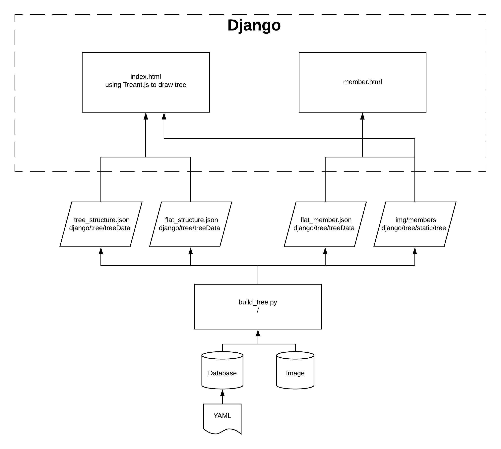

# Family Tree

<h3>TODO:</h3>

[ ] Upload static files to AWS S3


<h3>Getting Started</h3>

```bash
~$ python manage.py runserver

# Empty DB, if needed
~$ python manage.py emptyDB

# If update YAML file, need to load it first
~$ python manage.py loaddata <yaml_name>		# <yaml_name> is under <app>/fixtures/

# If add images into raw_img folder, need to process it
~$ python manage.py processRawImg

# Extract info to JSON files under tree/treeData/ to be sent to front-end
~$ python manage.py genTreeStructure
```


---

<h3>Flowchart</h3>

<a href="https://app.lucidchart.com/documents/edit/02831751-4abe-4677-a128-6e11d2871184/0_0?beaconFlowId=E534457B4CAB9F27">Link to the chart</a>




